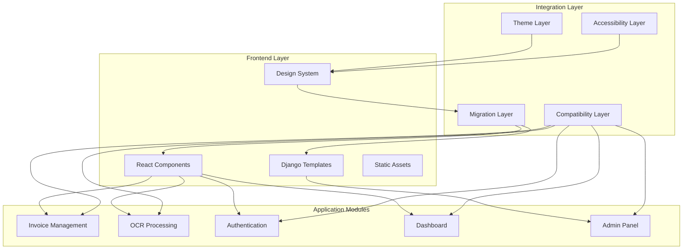

# Design Document

## Overview

This design document outlines the comprehensive integration strategy for implementing the FaktuLove design system across the entire application stack. The integration will be performed in phases to ensure minimal disruption while maximizing the benefits of consistent UI/UX, improved accessibility, and Polish business-specific functionality.

## Architecture

### Integration Architecture



### Component Integration Strategy

The integration follows a layered approach:

1. **Design System Core**: Provides tokens, components, and utilities
2. **Migration Layer**: Handles gradual component replacement
3. **Compatibility Layer**: Ensures backward compatibility during transition
4. **Application Layer**: Individual modules using design system components

## Components and Interfaces

### 1. Frontend Component Integration

#### React Component Mapping
- **Existing Components** → **Design System Components**
- `Button` → `@design-system/Button`
- `Input` → `@design-system/Input`
- `Table` → `@design-system/Table`
- `Form` → `@design-system/Form`
- `Card` → `@design-system/Card`

#### Polish Business Component Integration
- **Invoice Forms** → `CurrencyInput`, `VATRateSelector`, `DatePicker`
- **Validation** → `NIPValidator`, `ComplianceIndicator`
- **Status Display** → `InvoiceStatusBadge`

### 2. Django Template Integration

#### Template Component Bridge
```python
# Template tag for design system integration



    Utwórz fakturę



```

#### CSS Integration Strategy
```css
/* Design system CSS integration */
@import '@design-system/tokens.css';
@import '@design-system/base.css';
@import '@design-system/utilities.css';

/* Django-specific overrides */
.django-admin {
  @apply ds-theme-light;
}
```

### 3. OCR Interface Integration

#### Document Upload Component
```typescript
interface OCRUploadProps {
  onUpload: (file: File) => void;
  acceptedTypes: string[];
  maxSize: number;
  theme: 'light' | 'dark';
}

const OCRUpload: React.FC<OCRUploadProps> = ({
  onUpload,
  acceptedTypes,
  maxSize,
  theme
}) => {
  return (
    <Card variant="elevated" theme={theme}>
      <FileUpload
        onUpload={onUpload}
        acceptedTypes={acceptedTypes}
        maxSize={maxSize}
        dragAndDrop
        multiple
      />
    </Card>
  );
};
```

#### OCR Results Display
```typescript
interface OCRResultsProps {
  results: OCRResult[];
  onEdit: (field: string, value: string) => void;
  confidenceThreshold: number;
}

const OCRResults: React.FC<OCRResultsProps> = ({
  results,
  onEdit,
  confidenceThreshold
}) => {
  return (
    <Table
      data={results}
      columns={[
        {
          key: 'field',
          header: 'Pole',
          render: (value) => <Text variant="body-medium">{value}</Text>
        },
        {
          key: 'value',
          header: 'Wartość',
          render: (value, row) => (
            <Input
              value={value}
              onChange={(newValue) => onEdit(row.field, newValue)}
              variant={row.confidence < confidenceThreshold ? 'error' : 'default'}
            />
          )
        },
        {
          key: 'confidence',
          header: 'Pewność',
          render: (confidence) => (
            <Badge
              variant={confidence >= confidenceThreshold ? 'success' : 'warning'}
            >
              {Math.round(confidence * 100)}%
            </Badge>
          )
        }
      ]}
    />
  );
};
```

### 4. Invoice Management Integration

#### Invoice Form Component
```typescript
interface InvoiceFormProps {
  invoice?: Invoice;
  onSubmit: (data: InvoiceData) => void;
  companies: Company[];
}

const InvoiceForm: React.FC<InvoiceFormProps> = ({
  invoice,
  onSubmit,
  companies
}) => {
  return (
    <Form onSubmit={onSubmit} initialValues={invoice}>
      <Grid cols={2} gap="md">
        <Input
          name="number"
          label="Numer faktury"
          required
          pattern="^[A-Z0-9/-]+$"
        />
        
        <DatePicker
          name="issueDate"
          label="Data wystawienia"
          format="DD.MM.YYYY"
          required
        />
        
        <Select
          name="companyId"
          label="Firma"
          options={companies.map(c => ({
            value: c.id,
            label: c.name
          }))}
          required
        />
        
        <NIPValidator
          name="buyerNIP"
          label="NIP nabywcy"
          required
        />
        
        <CurrencyInput
          name="totalAmount"
          label="Kwota brutto"
          currency="PLN"
          required
        />
        
        <VATRateSelector
          name="vatRate"
          label="Stawka VAT"
          rates={[0, 5, 8, 23]}
          required
        />
      </Grid>
      
      <Flex justify="end" gap="sm" className="mt-6">
        <Button variant="secondary" type="button">
          Anuluj
        </Button>
        <Button variant="primary" type="submit">
          Zapisz fakturę
        </Button>
      </Flex>
    </Form>
  );
};
```

### 5. Dashboard Integration

#### Analytics Dashboard
```typescript
interface DashboardProps {
  metrics: DashboardMetrics;
  charts: ChartData[];
  theme: Theme;
}

const Dashboard: React.FC<DashboardProps> = ({
  metrics,
  charts,
  theme
}) => {
  return (
    <Container maxWidth="xl">
      <Grid cols={4} gap="lg" className="mb-8">
        {metrics.map((metric) => (
          <Card key={metric.id} variant="elevated">
            <Stack gap="sm">
              <Text variant="body-small" color="muted">
                {metric.label}
              </Text>
              <Text variant="heading-lg" color="primary">
                {metric.value}
              </Text>
              <Badge
                variant={metric.trend > 0 ? 'success' : 'error'}
                size="sm"
              >
                {metric.trend > 0 ? '+' : ''}{metric.trend}%
              </Badge>
            </Stack>
          </Card>
        ))}
      </Grid>
      
      <Grid cols={2} gap="lg">
        {charts.map((chart) => (
          <Card key={chart.id} variant="outlined">
            <Stack gap="md">
              <Text variant="heading-md">{chart.title}</Text>
              <ChartComponent
                data={chart.data}
                type={chart.type}
                theme={theme}
              />
            </Stack>
          </Card>
        ))}
      </Grid>
    </Container>
  );
};
```

## Data Models

### Theme Configuration
```typescript
interface ThemeConfig {
  name: string;
  colors: ColorTokens;
  typography: TypographyTokens;
  spacing: SpacingTokens;
  polishBusiness: {
    vatRates: number[];
    dateFormat: string;
    currencyFormat: CurrencyFormat;
    nipValidation: boolean;
  };
}
```

### Component Migration Mapping
```typescript
interface ComponentMapping {
  oldComponent: string;
  newComponent: string;
  propsMapping: Record<string, string>;
  migrationStrategy: 'replace' | 'wrap' | 'gradual';
  polishBusinessFeatures?: string[];
}
```

### Integration Status
```typescript
interface IntegrationStatus {
  module: string;
  componentsTotal: number;
  componentsMigrated: number;
  testsTotal: number;
  testsPassing: number;
  performanceScore: number;
  accessibilityScore: number;
}
```

## Error Handling

### Migration Error Handling
```typescript
class MigrationError extends Error {
  constructor(
    public component: string,
    public reason: string,
    public fallback?: string
  ) {
    super(`Migration failed for ${component}: ${reason}`);
  }
}

const handleMigrationError = (error: MigrationError) => {
  console.error('Migration Error:', error);
  
  if (error.fallback) {
    console.warn(`Using fallback component: ${error.fallback}`);
    return error.fallback;
  }
  
  // Report to monitoring system
  reportError(error);
  
  // Use compatibility layer
  return useCompatibilityLayer(error.component);
};
```

### Theme Error Handling
```typescript
const handleThemeError = (error: Error) => {
  console.error('Theme Error:', error);
  
  // Fallback to default theme
  return getDefaultTheme();
};
```

### Component Error Boundaries
```typescript
class DesignSystemErrorBoundary extends React.Component {
  state = { hasError: false, error: null };
  
  static getDerivedStateFromError(error: Error) {
    return { hasError: true, error };
  }
  
  componentDidCatch(error: Error, errorInfo: React.ErrorInfo) {
    console.error('Design System Error:', error, errorInfo);
    reportError(error, errorInfo);
  }
  
  render() {
    if (this.state.hasError) {
      return (
        <Card variant="error">
          <Text variant="body-medium">
            Wystąpił błąd w komponencie. Spróbuj odświeżyć stronę.
          </Text>
        </Card>
      );
    }
    
    return this.props.children;
  }
}
```

## Testing Strategy

### Unit Testing
- **Component Tests**: Test each design system component integration
- **Props Mapping Tests**: Verify correct prop transformation during migration
- **Polish Business Logic Tests**: Test NIP validation, VAT calculations, date formatting

### Integration Testing
- **Module Integration Tests**: Test complete module integration with design system
- **Theme Integration Tests**: Verify theme switching across all components
- **Accessibility Tests**: Automated WCAG compliance testing

### Visual Regression Testing
- **Screenshot Comparison**: Automated visual diff testing
- **Cross-browser Testing**: Visual consistency across browsers
- **Responsive Testing**: Layout testing across breakpoints

### Performance Testing
- **Bundle Size Analysis**: Monitor bundle size impact
- **Render Performance**: Measure component render times
- **Memory Usage**: Monitor memory consumption during migration

### End-to-End Testing
- **User Workflow Tests**: Test complete user journeys with new components
- **Polish Business Workflow Tests**: Test invoice creation, OCR processing, etc.
- **Cross-module Integration Tests**: Test interactions between different modules

## Migration Phases

### Phase 1: Core Infrastructure (Week 1-2)
- Set up design system build integration
- Implement theme provider at application root
- Create compatibility layer
- Set up testing infrastructure

### Phase 2: Primitive Components (Week 3-4)
- Migrate buttons, inputs, selects
- Implement form components
- Add error handling and validation
- Update unit tests

### Phase 3: Layout Components (Week 5-6)
- Migrate navigation and sidebar
- Implement grid and container components
- Update responsive layouts
- Test cross-browser compatibility

### Phase 4: Business Components (Week 7-8)
- Integrate Polish business components
- Migrate invoice forms and tables
- Implement OCR interface components
- Add Polish business validation

### Phase 5: Complex Modules (Week 9-10)
- Migrate dashboard and analytics
- Update admin panel styling
- Integrate authentication flows
- Implement advanced features

### Phase 6: Testing and Optimization (Week 11-12)
- Comprehensive testing across all modules
- Performance optimization
- Accessibility audit and fixes
- Documentation updates

## Performance Considerations

### Bundle Optimization
- **Tree Shaking**: Remove unused design system components
- **Code Splitting**: Load components on demand
- **CSS Optimization**: Minimize and optimize CSS output

### Runtime Performance
- **Component Memoization**: Optimize re-renders
- **Theme Caching**: Cache theme calculations
- **Lazy Loading**: Load heavy components when needed

### Memory Management
- **Component Cleanup**: Proper cleanup of event listeners
- **Theme Memory**: Efficient theme storage and retrieval
- **Asset Optimization**: Optimize images and fonts

## Accessibility Implementation

### WCAG 2.1 AA Compliance
- **Keyboard Navigation**: Full keyboard accessibility
- **Screen Reader Support**: Proper ARIA labels and descriptions
- **Color Contrast**: Minimum 4.5:1 contrast ratio
- **Focus Management**: Visible focus indicators

### Polish Language Support
- **Text Direction**: Proper LTR text handling
- **Date Formats**: Polish date format support
- **Number Formats**: Polish number and currency formatting
- **Validation Messages**: Polish error messages

## Security Considerations

### Input Validation
- **XSS Prevention**: Sanitize all user inputs
- **CSRF Protection**: Maintain CSRF token handling
- **Data Validation**: Validate Polish business data (NIP, REGON, etc.)

### Theme Security
- **CSS Injection Prevention**: Sanitize theme customizations
- **Asset Security**: Secure loading of theme assets
- **User Preferences**: Secure storage of user theme preferences