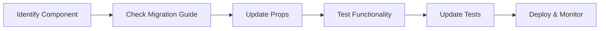

# Component Migration Guide

This guide provides comprehensive instructions for migrating existing FaktuLove components to the new design system. It covers prop mapping, breaking changes, troubleshooting, and Polish business component usage.

## Table of Contents

1. [Migration Overview](#migration-overview)
2. [Primitive Components](#primitive-components)
3. [Form Components](#form-components)
4. [Layout Components](#layout-components)
5. [Polish Business Components](#polish-business-components)
6. [Breaking Changes](#breaking-changes)
7. [Troubleshooting](#troubleshooting)
8. [Migration Checklist](#migration-checklist)

## Migration Overview

### Migration Strategy

The design system migration follows a **gradual replacement** approach:

1. **Compatibility Layer**: Old components continue to work during transition
2. **Prop Mapping**: Automatic translation of old props to new design system props
3. **Fallback Mechanisms**: Graceful degradation when new components fail
4. **Testing Integration**: Comprehensive testing ensures no functionality loss

### Migration Process



## Primitive Components

### Button Migration

#### Old Component
```jsx
// Before - Legacy Button
<button 
  className="btn btn-primary btn-lg"
  onClick={handleClick}
  disabled={isLoading}
>
  Zapisz fakturę
</button>
```

#### New Component
```jsx
// After - Design System Button
import { Button } from '@design-system/primitives';

<Button
  variant="primary"
  size="lg"
  onClick={handleClick}
  loading={isLoading}
>
  Zapisz fakturę
</Button>
```

#### Prop Mapping
| Old Prop | New Prop | Notes |
|----------|----------|-------|
| `className="btn-primary"` | `variant="primary"` | Semantic variants |
| `className="btn-lg"` | `size="lg"` | Size tokens |
| `disabled={isLoading}` | `loading={isLoading}` | Loading state handling |

### Input Migration

#### Old Component
```jsx
// Before - Legacy Input
<input
  type="text"
  className="form-control"
  placeholder="Wprowadź NIP"
  value={nip}
  onChange={(e) => setNip(e.target.value)}
  required
/>
```

#### New Component
```jsx
// After - Design System Input
import { Input } from '@design-system/primitives';

<Input
  label="NIP firmy"
  placeholder="Wprowadź NIP"
  value={nip}
  onChange={setNip}
  required
  validation="nip"
/>
```

#### Prop Mapping
| Old Prop | New Prop | Notes |
|----------|----------|-------|
| `className="form-control"` | Built-in styling | No class needed |
| `onChange={(e) => setNip(e.target.value)}` | `onChange={setNip}` | Simplified handler |
| Manual validation | `validation="nip"` | Built-in Polish validation |

### Select Migration

#### Old Component
```jsx
// Before - Legacy Select
<select 
  className="form-select"
  value={vatRate}
  onChange={(e) => setVatRate(e.target.value)}
>
  <option value="0">0%</option>
  <option value="5">5%</option>
  <option value="8">8%</option>
  <option value="23">23%</option>
</select>
```

#### New Component
```jsx
// After - Design System Select
import { Select } from '@design-system/primitives';

<Select
  label="Stawka VAT"
  value={vatRate}
  onChange={setVatRate}
  options={[
    { value: '0', label: '0%' },
    { value: '5', label: '5%' },
    { value: '8', label: '8%' },
    { value: '23', label: '23%' }
  ]}
/>
```

## Form Components

### Form Migration

#### Old Component
```jsx
// Before - Legacy Form
<form onSubmit={handleSubmit} className="needs-validation">
  <div className="row">
    <div className="col-md-6">
      <input type="text" name="invoiceNumber" required />
    </div>
    <div className="col-md-6">
      <input type="date" name="issueDate" required />
    </div>
  </div>
  <button type="submit" className="btn btn-primary">
    Zapisz
  </button>
</form>
```

#### New Component
```jsx
// After - Design System Form
import { Form, Grid, Input, Button } from '@design-system/components';

<Form onSubmit={handleSubmit} validation="polish-business">
  <Grid cols={2} gap="md">
    <Input
      name="invoiceNumber"
      label="Numer faktury"
      required
      validation="invoice-number"
    />
    <Input
      name="issueDate"
      label="Data wystawienia"
      type="date"
      required
      format="polish-date"
    />
  </Grid>
  <Button type="submit" variant="primary">
    Zapisz
  </Button>
</Form>
```

### Form Validation Migration

#### Old Validation
```jsx
// Before - Manual validation
const validateNIP = (nip) => {
  const nipRegex = /^\d{10}$/;
  if (!nipRegex.test(nip)) {
    setError('NIP musi składać się z 10 cyfr');
    return false;
  }
  return true;
};
```

#### New Validation
```jsx
// After - Built-in validation
import { NIPValidator } from '@design-system/business';

<NIPValidator
  name="nip"
  label="NIP firmy"
  required
  onValidation={(isValid, message) => {
    if (!isValid) {
      setError(message);
    }
  }}
/>
```

## Layout Components

### Grid Migration

#### Old Layout
```jsx
// Before - Bootstrap Grid
<div className="container">
  <div className="row">
    <div className="col-md-8">
      <main>Content</main>
    </div>
    <div className="col-md-4">
      <aside>Sidebar</aside>
    </div>
  </div>
</div>
```

#### New Layout
```jsx
// After - Design System Grid
import { Container, Grid } from '@design-system/layout';

<Container maxWidth="xl">
  <Grid cols={[1, 2]} colSpan={[1, '2fr 1fr']} gap="lg">
    <main>Content</main>
    <aside>Sidebar</aside>
  </Grid>
</Container>
```

### Card Migration

#### Old Card
```jsx
// Before - Bootstrap Card
<div className="card">
  <div className="card-header">
    <h5 className="card-title">Faktura #001</h5>
  </div>
  <div className="card-body">
    <p className="card-text">Szczegóły faktury...</p>
  </div>
</div>
```

#### New Card
```jsx
// After - Design System Card
import { Card, Text } from '@design-system/components';

<Card variant="elevated">
  <Card.Header>
    <Text variant="heading-md">Faktura #001</Text>
  </Card.Header>
  <Card.Body>
    <Text variant="body-medium">Szczegóły faktury...</Text>
  </Card.Body>
</Card>
```

## Polish Business Components

### Currency Input Migration

#### Old Currency Input
```jsx
// Before - Manual currency handling
<input
  type="number"
  step="0.01"
  value={amount}
  onChange={(e) => setAmount(parseFloat(e.target.value))}
  placeholder="0.00"
/>
<span>PLN</span>
```

#### New Currency Input
```jsx
// After - Polish Business CurrencyInput
import { CurrencyInput } from '@design-system/business';

<CurrencyInput
  label="Kwota brutto"
  value={amount}
  onChange={setAmount}
  currency="PLN"
  validation="polish-currency"
  formatOnBlur
/>
```

### NIP Validator Migration

#### Old NIP Validation
```jsx
// Before - Manual NIP validation
const [nip, setNip] = useState('');
const [nipError, setNipError] = useState('');

const validateNIP = (value) => {
  // Manual NIP validation logic
  const weights = [6, 5, 7, 2, 3, 4, 5, 6, 7];
  // ... validation implementation
};

<input
  value={nip}
  onChange={(e) => {
    setNip(e.target.value);
    validateNIP(e.target.value);
  }}
/>
{nipError && <div className="error">{nipError}</div>}
```

#### New NIP Validator
```jsx
// After - Design System NIPValidator
import { NIPValidator } from '@design-system/business';

<NIPValidator
  label="NIP kontrahenta"
  value={nip}
  onChange={setNip}
  required
  validateOnBlur
  showValidationIcon
/>
```

### VAT Rate Selector Migration

#### Old VAT Selector
```jsx
// Before - Manual VAT rates
<select value={vatRate} onChange={(e) => setVatRate(e.target.value)}>
  <option value="0">Zwolnione z VAT (0%)</option>
  <option value="5">Obniżona stawka (5%)</option>
  <option value="8">Obniżona stawka (8%)</option>
  <option value="23">Podstawowa stawka (23%)</option>
</select>
```

#### New VAT Rate Selector
```jsx
// After - Design System VATRateSelector
import { VATRateSelector } from '@design-system/business';

<VATRateSelector
  label="Stawka VAT"
  value={vatRate}
  onChange={setVatRate}
  includeDescriptions
  showCalculation
  required
/>
```

### Date Picker Migration

#### Old Date Input
```jsx
// Before - Basic date input
<input
  type="date"
  value={date}
  onChange={(e) => setDate(e.target.value)}
/>
```

#### New Polish Date Picker
```jsx
// After - Design System DatePicker
import { DatePicker } from '@design-system/business';

<DatePicker
  label="Data wystawienia"
  value={date}
  onChange={setDate}
  format="DD.MM.YYYY"
  locale="pl"
  businessDays
  holidays="polish"
/>
```

## Breaking Changes

### CSS Class Changes

#### Bootstrap to Design System Classes
| Old Bootstrap Class | New Design System Class | Migration |
|-------------------|------------------------|-----------|
| `.btn-primary` | Use `<Button variant="primary">` | Replace with component |
| `.form-control` | Use `<Input>` component | Replace with component |
| `.card` | Use `<Card>` component | Replace with component |
| `.row`, `.col-*` | Use `<Grid>` component | Replace with component |
| `.text-primary` | Use `<Text color="primary">` | Replace with component |

#### Custom CSS Updates
```css
/* Before - Custom styles */
.invoice-form .btn {
  margin-top: 1rem;
}

.invoice-table th {
  background-color: #f8f9fa;
}

/* After - Design system tokens */
.invoice-form {
  --ds-button-margin-top: var(--ds-space-4);
}

.invoice-table {
  --ds-table-header-bg: var(--ds-color-neutral-50);
}
```

### JavaScript API Changes

#### Event Handler Changes
```jsx
// Before - Event object handling
onChange={(e) => setValue(e.target.value)}

// After - Direct value handling
onChange={(value) => setValue(value)}
```

#### Validation Changes
```jsx
// Before - Manual validation
const [errors, setErrors] = useState({});

// After - Built-in validation
// Validation handled automatically by components
```

### Component Structure Changes

#### Compound Components
```jsx
// Before - Single component
<Modal title="Edytuj fakturę" onClose={handleClose}>
  Content here
</Modal>

// After - Compound component
<Modal onClose={handleClose}>
  <Modal.Header>
    <Modal.Title>Edytuj fakturę</Modal.Title>
  </Modal.Header>
  <Modal.Body>
    Content here
  </Modal.Body>
</Modal>
```

## Troubleshooting

### Common Migration Issues

#### Issue 1: Styling Conflicts
**Problem**: Old CSS conflicts with design system styles
```css
/* Problematic CSS */
.btn {
  background: red !important;
}
```

**Solution**: Use design system theming
```css
/* Fixed CSS */
.custom-button {
  --ds-button-bg-primary: var(--ds-color-red-500);
}
```

#### Issue 2: Event Handler Mismatch
**Problem**: Old event handlers don't work with new components
```jsx
// Problematic code
<Input onChange={(e) => setValue(e.target.value)} />
```

**Solution**: Update to new API
```jsx
// Fixed code
<Input onChange={(value) => setValue(value)} />
```

#### Issue 3: Missing Props
**Problem**: Old props not supported in new components
```jsx
// Problematic code
<Button className="custom-class" />
```

**Solution**: Use design system patterns
```jsx
// Fixed code
<Button variant="custom" />
// Or use CSS custom properties
<Button style={{'--ds-button-bg': 'custom-color'}} />
```

#### Issue 4: Polish Characters Display
**Problem**: Polish characters not displaying correctly
```jsx
// Problematic code
<Text>Błędne wyświetlanie</Text>
```

**Solution**: Ensure proper locale setup
```jsx
// Fixed code
<ThemeProvider locale="pl">
  <Text>Poprawne wyświetlanie</Text>
</ThemeProvider>
```

### Performance Issues

#### Issue 1: Bundle Size Increase
**Problem**: Design system increases bundle size

**Solution**: Use tree shaking and lazy loading
```jsx
// Instead of importing everything
import { Button, Input, Select } from '@design-system/components';

// Import only what you need
import { Button } from '@design-system/primitives/Button';
import { Input } from '@design-system/primitives/Input';
```

#### Issue 2: Slow Component Rendering
**Problem**: New components render slower than expected

**Solution**: Use React.memo and proper dependencies
```jsx
// Optimized component
const OptimizedInvoiceForm = React.memo(({ invoice, onSubmit }) => {
  // Component implementation
}, (prevProps, nextProps) => {
  return prevProps.invoice.id === nextProps.invoice.id;
});
```

### Testing Issues

#### Issue 1: Test Selectors Changed
**Problem**: Existing tests fail due to changed DOM structure

**Solution**: Update test selectors to use design system test IDs
```jsx
// Before
screen.getByClassName('btn-primary')

// After
screen.getByTestId('ds-button-primary')
// Or use semantic queries
screen.getByRole('button', { name: /zapisz/i })
```

#### Issue 2: Snapshot Tests Failing
**Problem**: Component snapshots don't match

**Solution**: Update snapshots and use semantic testing
```jsx
// Instead of snapshot testing
expect(component).toMatchSnapshot();

// Use behavior testing
expect(screen.getByRole('button')).toBeInTheDocument();
expect(screen.getByLabelText('NIP firmy')).toHaveValue('1234567890');
```

## Migration Checklist

### Pre-Migration Checklist
- [ ] Review component usage in codebase
- [ ] Identify custom styling that needs migration
- [ ] Plan testing strategy for migrated components
- [ ] Set up design system development environment
- [ ] Create backup of current implementation

### Component Migration Checklist
- [ ] Update component imports
- [ ] Map old props to new props
- [ ] Update event handlers
- [ ] Replace CSS classes with design system components
- [ ] Add proper TypeScript types
- [ ] Update component tests
- [ ] Test accessibility compliance
- [ ] Verify Polish business functionality

### Post-Migration Checklist
- [ ] Run full test suite
- [ ] Perform visual regression testing
- [ ] Test keyboard navigation
- [ ] Verify screen reader compatibility
- [ ] Check performance metrics
- [ ] Update documentation
- [ ] Deploy to staging environment
- [ ] Conduct user acceptance testing

### Polish Business Validation Checklist
- [ ] NIP validation works correctly
- [ ] VAT calculations are accurate
- [ ] Date formats follow Polish standards
- [ ] Currency formatting uses Polish złoty
- [ ] Business document compliance maintained
- [ ] Regulatory requirements satisfied

## Migration Examples by Module

### Invoice Management Module
```jsx
// Complete invoice form migration example
import {
  Form,
  Grid,
  Input,
  Select,
  Button,
  Card,
  Text
} from '@design-system/components';
import {
  CurrencyInput,
  NIPValidator,
  VATRateSelector,
  DatePicker
} from '@design-system/business';

const InvoiceForm = ({ invoice, onSubmit, companies }) => {
  return (
    <Card variant="elevated">
      <Card.Header>
        <Text variant="heading-lg">
          {invoice ? 'Edytuj fakturę' : 'Nowa faktura'}
        </Text>
      </Card.Header>
      
      <Card.Body>
        <Form onSubmit={onSubmit} initialValues={invoice}>
          <Grid cols={2} gap="md">
            <Input
              name="number"
              label="Numer faktury"
              required
              validation="invoice-number"
            />
            
            <DatePicker
              name="issueDate"
              label="Data wystawienia"
              required
              format="DD.MM.YYYY"
              locale="pl"
            />
            
            <Select
              name="companyId"
              label="Firma wystawiająca"
              options={companies}
              required
            />
            
            <NIPValidator
              name="buyerNIP"
              label="NIP nabywcy"
              required
            />
            
            <CurrencyInput
              name="netAmount"
              label="Kwota netto"
              currency="PLN"
              required
            />
            
            <VATRateSelector
              name="vatRate"
              label="Stawka VAT"
              required
            />
          </Grid>
          
          <Grid cols={1} className="mt-6">
            <Button type="submit" variant="primary" size="lg">
              Zapisz fakturę
            </Button>
          </Grid>
        </Form>
      </Card.Body>
    </Card>
  );
};
```

### OCR Results Module
```jsx
// OCR results display migration example
import {
  Table,
  Badge,
  Button,
  Input,
  Card,
  Text,
  Stack
} from '@design-system/components';

const OCRResults = ({ results, onEdit, confidenceThreshold }) => {
  return (
    <Card variant="outlined">
      <Card.Header>
        <Text variant="heading-md">Wyniki OCR</Text>
      </Card.Header>
      
      <Card.Body>
        <Table
          data={results}
          columns={[
            {
              key: 'field',
              header: 'Pole',
              render: (value) => (
                <Text variant="body-medium" weight="medium">
                  {value}
                </Text>
              )
            },
            {
              key: 'value',
              header: 'Wartość',
              render: (value, row) => (
                <Input
                  value={value}
                  onChange={(newValue) => onEdit(row.field, newValue)}
                  variant={row.confidence < confidenceThreshold ? 'error' : 'default'}
                  size="sm"
                />
              )
            },
            {
              key: 'confidence',
              header: 'Pewność',
              render: (confidence) => (
                <Badge
                  variant={confidence >= confidenceThreshold ? 'success' : 'warning'}
                  size="sm"
                >
                  {Math.round(confidence * 100)}%
                </Badge>
              )
            },
            {
              key: 'actions',
              header: 'Akcje',
              render: (_, row) => (
                <Stack direction="row" gap="xs">
                  <Button
                    variant="ghost"
                    size="sm"
                    onClick={() => onEdit(row.field, row.suggestedValue)}
                  >
                    Zaakceptuj
                  </Button>
                  <Button
                    variant="ghost"
                    size="sm"
                    onClick={() => onEdit(row.field, '')}
                  >
                    Wyczyść
                  </Button>
                </Stack>
              )
            }
          ]}
        />
      </Card.Body>
    </Card>
  );
};
```

This migration guide provides comprehensive instructions for transitioning from legacy components to the design system while maintaining Polish business functionality and ensuring accessibility compliance.