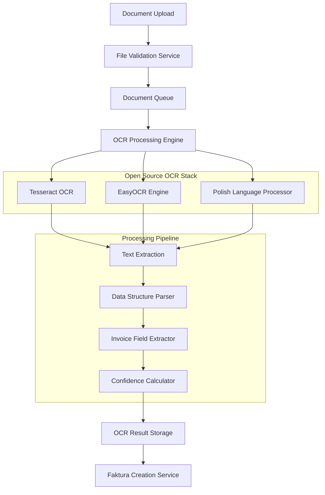

# Design Document

## Overview

This document outlines the technical design for migrating FaktuLove2's OCR system from Google Cloud Document AI to a comprehensive open-source solution. The migration will replace Google Cloud dependencies with a self-hosted OCR stack while maintaining API compatibility and improving Polish language support.

## Architecture

### Current System Analysis

The current system has the following Google Cloud dependencies:

1. **Google Cloud Document AI Service** (`faktury/services/document_ai_service.py`)
   - Primary OCR processing engine
   - Handles document parsing and data extraction
   - Provides confidence scoring and field mapping

2. **Google Cloud Authentication** 
   - Requires `GOOGLE_APPLICATION_CREDENTIALS`
   - Uses `google.auth.exceptions.DefaultCredentialsError`
   - Configured in `settings.DOCUMENT_AI_CONFIG`

3. **Document AI Client Integration**
   - `documentai.DocumentProcessorServiceClient()`
   - `documentai.RawDocument` and `documentai.ProcessRequest`
   - Processor path generation and validation

### New Architecture Design



## Components and Interfaces

### 1. OCR Engine Abstraction Layer

**File:** `faktury/services/ocr_engine_service.py`

```python
class OCREngineService:
    """Abstract base class for OCR engines"""
    
    def process_document(self, file_content: bytes, mime_type: str) -> Dict[str, Any]:
        """Process document and return extracted data"""
        pass
    
    def get_confidence_score(self, result: Dict) -> float:
        """Calculate confidence score for extraction"""
        pass
    
    def supports_format(self, mime_type: str) -> bool:
        """Check if engine supports file format"""
        pass
```

**Implementations:**
- `TesseractOCREngine` - Primary OCR engine using Tesseract 5.x
- `EasyOCREngine` - Secondary engine for improved accuracy
- `CompositeOCREngine` - Combines multiple engines for best results

### 2. Document Processing Pipeline

**File:** `faktury/services/document_processor.py`

```python
class DocumentProcessor:
    """Main document processing orchestrator"""
    
    def __init__(self):
        self.ocr_engines = [
            TesseractOCREngine(),
            EasyOCREngine()
        ]
        self.polish_processor = PolishInvoiceProcessor()
        self.field_extractor = InvoiceFieldExtractor()
    
    def process_invoice(self, file_content: bytes, mime_type: str) -> Dict[str, Any]:
        """Process invoice through complete pipeline"""
        # 1. Image preprocessing
        # 2. OCR text extraction
        # 3. Polish language enhancement
        # 4. Structured data extraction
        # 5. Confidence calculation
        pass
```

### 3. Image Preprocessing Service

**File:** `faktury/services/image_preprocessor.py`

```python
class ImagePreprocessor:
    """Preprocess images for optimal OCR results"""
    
    def preprocess_document(self, file_content: bytes, mime_type: str) -> bytes:
        """Apply preprocessing filters to improve OCR accuracy"""
        # 1. Convert PDF to images if needed
        # 2. Deskew and rotate
        # 3. Noise reduction
        # 4. Contrast enhancement
        # 5. Resolution optimization
        pass
```

### 4. Enhanced Polish Language Processor

**Enhancement of:** `faktury/services/polish_invoice_processor.py`

The existing Polish processor will be enhanced with:
- Advanced regex patterns for Polish business formats
- Machine learning-based entity recognition
- Improved confidence scoring for Polish-specific elements
- Support for multiple Polish invoice layouts

### 5. Invoice Field Extractor

**File:** `faktury/services/invoice_field_extractor.py`

```python
class InvoiceFieldExtractor:
    """Extract structured invoice data from OCR text"""
    
    def extract_fields(self, ocr_text: str, confidence_data: Dict) -> Dict[str, Any]:
        """Extract invoice fields using pattern matching and ML"""
        # 1. Invoice number extraction
        # 2. Date parsing (multiple formats)
        # 3. Company information extraction
        # 4. Amount and VAT calculation
        # 5. Line item parsing
        pass
```

### 6. Confidence Calculation Engine

**File:** `faktury/services/confidence_calculator.py`

```python
class ConfidenceCalculator:
    """Calculate confidence scores for extracted data"""
    
    def calculate_overall_confidence(self, extracted_data: Dict, ocr_confidence: Dict) -> float:
        """Calculate weighted confidence score"""
        # 1. OCR engine confidence
        # 2. Pattern matching confidence
        # 3. Data validation confidence
        # 4. Polish language boost
        # 5. Cross-validation between engines
        pass
```

## Data Models

### Enhanced OCR Models

The existing models will be enhanced to support the new architecture:

```python
# Addition to faktury/models.py

class OCREngine(models.Model):
    """Track different OCR engines and their performance"""
    name = models.CharField(max_length=50)
    version = models.CharField(max_length=20)
    is_active = models.BooleanField(default=True)
    priority = models.IntegerField(default=1)
    
class OCRProcessingStep(models.Model):
    """Track individual processing steps"""
    ocr_result = models.ForeignKey(OCRResult, on_delete=models.CASCADE)
    step_name = models.CharField(max_length=50)
    engine_used = models.ForeignKey(OCREngine, on_delete=models.CASCADE)
    processing_time = models.FloatField()
    confidence_score = models.FloatField()
    step_data = models.JSONField()
```

### Migration Strategy for Existing Data

```python
# Migration script structure
class Migration:
    def migrate_ocr_results(self):
        """Migrate existing OCR results to new format"""
        # 1. Update processor_version field
        # 2. Add engine tracking data
        # 3. Recalculate confidence scores
        # 4. Preserve all existing functionality
```

## Error Handling

### Fallback Strategy

```python
class OCRFallbackHandler:
    """Handle OCR processing failures gracefully"""
    
    def handle_processing_failure(self, document_id: int, error: Exception):
        """Implement fallback processing strategies"""
        # 1. Try alternative OCR engine
        # 2. Apply different preprocessing
        # 3. Use lower quality settings
        # 4. Mark for manual review
        # 5. Preserve original error information
```

### Error Recovery Mechanisms

1. **Engine Failure Recovery**: Automatically switch to backup OCR engine
2. **Preprocessing Retry**: Try different image preprocessing settings
3. **Partial Success Handling**: Accept partial results with lower confidence
4. **Manual Review Queue**: Route failed documents to human review
5. **Error Logging**: Comprehensive error tracking for debugging

## Testing Strategy

### 1. Unit Testing

```python
# Test structure for new components
class TestOCREngineService(TestCase):
    def test_tesseract_processing(self):
        """Test Tesseract OCR engine"""
        pass
    
    def test_easyocr_processing(self):
        """Test EasyOCR engine"""
        pass
    
    def test_confidence_calculation(self):
        """Test confidence scoring"""
        pass
```

### 2. Integration Testing

```python
class TestOCRPipeline(TestCase):
    def test_end_to_end_processing(self):
        """Test complete OCR pipeline"""
        pass
    
    def test_polish_invoice_accuracy(self):
        """Test Polish invoice processing accuracy"""
        pass
    
    def test_api_compatibility(self):
        """Test API backward compatibility"""
        pass
```

### 3. Performance Testing

```python
class TestOCRPerformance(TestCase):
    def test_processing_speed(self):
        """Test processing time requirements"""
        pass
    
    def test_concurrent_processing(self):
        """Test multiple document processing"""
        pass
    
    def test_memory_usage(self):
        """Test memory consumption"""
        pass
```

### 4. Accuracy Testing

- **Benchmark Dataset**: Create test dataset of 100+ Polish invoices
- **Accuracy Metrics**: Compare field extraction accuracy with Google Cloud
- **Regression Testing**: Ensure accuracy doesn't degrade over time
- **A/B Testing**: Compare different OCR engine combinations

## Deployment Strategy

### 1. Infrastructure Requirements

```yaml
# Docker Compose configuration
version: '3.8'
services:
  ocr-processor:
    image: faktulove/ocr-processor:latest
    environment:
      - TESSERACT_VERSION=5.3.0
      - EASYOCR_VERSION=1.7.0
      - POLISH_LANG_PACK=enabled
    volumes:
      - ./models:/app/models
      - ./temp:/app/temp
    resources:
      limits:
        memory: 4G
        cpus: '2.0'
```

### 2. System Dependencies

```bash
# Required system packages
apt-get install -y \
    tesseract-ocr \
    tesseract-ocr-pol \
    libtesseract-dev \
    poppler-utils \
    imagemagick \
    python3-opencv
```

### 3. Python Dependencies

```txt
# Additional requirements.txt entries
tesseract==0.1.3
easyocr==1.7.0
opencv-python==4.8.0
pdf2image==1.16.3
Pillow==10.0.0
numpy==1.24.3
scikit-image==0.21.0
```

### 4. Model Management

```python
class OCRModelManager:
    """Manage OCR models and language packs"""
    
    def download_models(self):
        """Download required OCR models"""
        # 1. Tesseract language packs
        # 2. EasyOCR model weights
        # 3. Custom Polish invoice models
        pass
    
    def update_models(self):
        """Update models to latest versions"""
        pass
```

## Migration Plan

### Phase 1: Infrastructure Setup (Week 1-2)
1. Set up OCR processing environment
2. Install and configure Tesseract and EasyOCR
3. Create Docker containers for OCR services
4. Set up monitoring and logging

### Phase 2: Core Implementation (Week 3-4)
1. Implement OCR engine abstraction layer
2. Create document processing pipeline
3. Enhance Polish language processor
4. Implement confidence calculation

### Phase 3: Integration and Testing (Week 5-6)
1. Integrate new OCR service with existing codebase
2. Implement fallback mechanisms
3. Create comprehensive test suite
4. Performance optimization

### Phase 4: Migration and Deployment (Week 7-8)
1. Create data migration scripts
2. Implement feature flags for gradual rollout
3. Deploy to staging environment
4. Conduct user acceptance testing

### Phase 5: Production Rollout (Week 9-10)
1. Deploy to production with feature flags
2. Monitor performance and accuracy
3. Gradually migrate all processing to new system
4. Remove Google Cloud dependencies

## Risk Mitigation

### Technical Risks

1. **Accuracy Degradation**
   - Mitigation: Extensive testing with benchmark datasets
   - Fallback: Keep Google Cloud as emergency backup initially

2. **Performance Issues**
   - Mitigation: Load testing and optimization
   - Fallback: Horizontal scaling and caching

3. **Integration Complexity**
   - Mitigation: Gradual migration with feature flags
   - Fallback: Rollback procedures

### Operational Risks

1. **Deployment Issues**
   - Mitigation: Comprehensive deployment testing
   - Fallback: Blue-green deployment strategy

2. **Resource Requirements**
   - Mitigation: Capacity planning and monitoring
   - Fallback: Auto-scaling configuration

3. **Data Migration Problems**
   - Mitigation: Extensive testing and validation
   - Fallback: Database backup and restore procedures

## Success Metrics

### Performance Metrics
- Processing time: ≤ 30 seconds per document
- Accuracy: ≥ 85% field extraction accuracy
- Throughput: ≥ 100 documents per hour
- Uptime: ≥ 99.5% availability

### Quality Metrics
- Polish invoice accuracy: ≥ 90%
- Confidence score accuracy: ≥ 95%
- Error rate: ≤ 5%
- User satisfaction: ≥ 4.5/5

### Business Metrics
- Cost reduction: 100% elimination of Google Cloud costs
- Vendor independence: 0% external dependencies
- Compliance: 100% on-premises processing
- Scalability: Support for 10x current volume