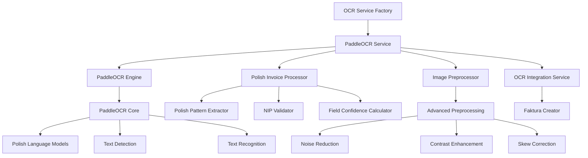
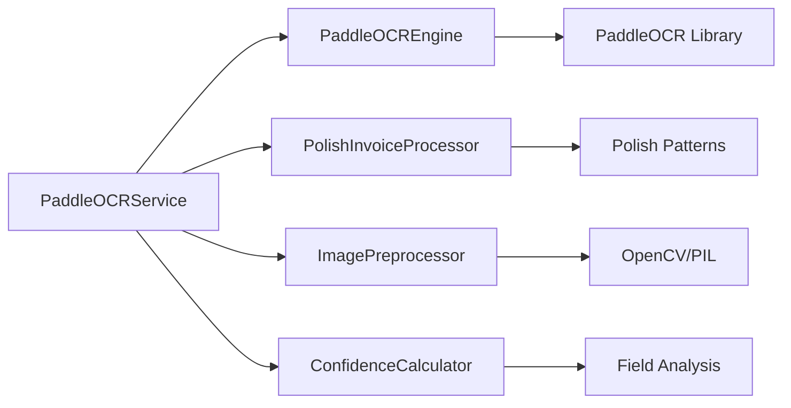
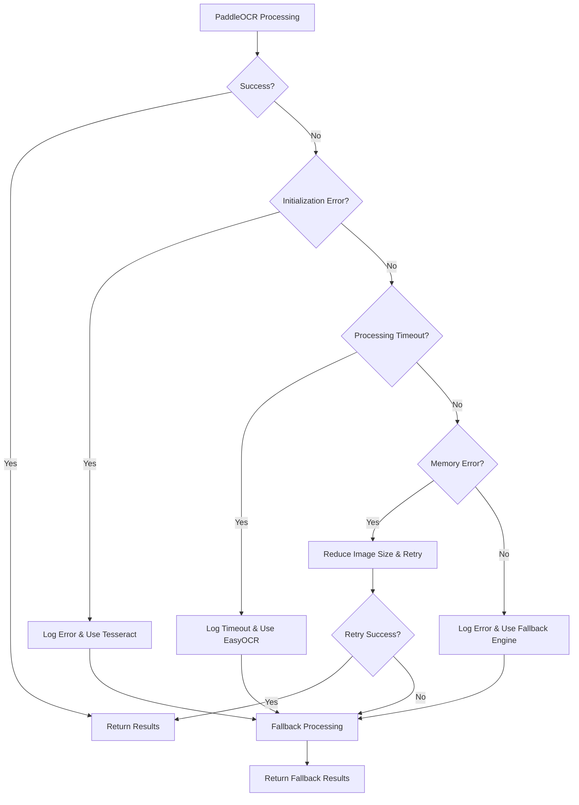

# Design Document

## Overview

This design document outlines the implementation of PaddleOCR as the primary OCR engine for the FaktuLove Polish invoice management system. PaddleOCR will be integrated as a new OCR engine following the existing architecture patterns while providing superior accuracy for Polish documents through specialized preprocessing, pattern recognition, and confidence scoring algorithms.

The implementation follows the established OCR service factory pattern, ensuring seamless integration with existing workflows while providing enhanced capabilities specifically optimized for Polish invoice processing.

## Architecture

### High-Level Architecture



### Integration Points

1. **OCR Service Factory**: PaddleOCR will be registered as a new engine type ('paddleocr')
2. **Document Processor**: Integration with existing document processing pipeline
3. **Polish Invoice Processor**: Enhanced with PaddleOCR-specific optimizations
4. **OCR Integration Service**: Seamless compatibility with existing invoice creation workflow
5. **Database Models**: Utilizes existing OCRResult and DocumentUpload models

### Service Layer Architecture



## Components and Interfaces

### 1. PaddleOCRService Class

**Location**: `faktury/services/paddle_ocr_service.py`

**Primary Interface**:
```python
class PaddleOCRService:
    def __init__(self, 
                 languages: List[str] = ['pl', 'en'],
                 use_gpu: bool = False,
                 det_model_dir: Optional[str] = None,
                 rec_model_dir: Optional[str] = None,
                 cls_model_dir: Optional[str] = None):
        """Initialize PaddleOCR with Polish language support"""
    
    def process_invoice(self, file_content: bytes, mime_type: str) -> Dict[str, Any]:
        """Main processing method - compatible with existing OCR services"""
    
    def extract_invoice_fields(self, processing_result) -> Dict[str, Any]:
        """Extract structured invoice data from OCR results"""
    
    def preprocess_image(self, image: np.ndarray) -> np.ndarray:
        """Advanced image preprocessing for Polish documents"""
    
    def extract_polish_patterns(self, text: str) -> Dict[str, Any]:
        """Polish-specific pattern extraction and validation"""
    
    def validate_nip(self, nip: str) -> bool:
        """Polish NIP validation with checksum verification"""
    
    def calculate_confidence_score(self, ocr_results: List[Dict]) -> float:
        """Advanced confidence scoring algorithm"""
```

### 2. PaddleOCREngine Class

**Location**: `faktury/services/paddle_ocr_engine.py`

**Extends**: `OCREngineService` (following existing pattern)

**Key Methods**:
```python
class PaddleOCREngine(OCREngineService):
    def initialize(self) -> bool:
        """Initialize PaddleOCR with Polish models"""
    
    def process_document(self, file_content: bytes, mime_type: str) -> Dict[str, Any]:
        """Process document using PaddleOCR"""
    
    def get_confidence_score(self, result: Dict[str, Any]) -> float:
        """Calculate confidence from PaddleOCR results"""
```

### 3. Enhanced Polish Invoice Processor

**Location**: `faktury/services/enhanced_polish_processor.py`

**Specialized Methods**:
```python
class EnhancedPolishProcessor:
    def extract_polish_invoice_fields(self, text: str, ocr_boxes: List[Dict]) -> Dict[str, Any]:
        """Extract Polish invoice fields using spatial analysis"""
    
    def validate_polish_patterns(self, extracted_data: Dict[str, Any]) -> Dict[str, bool]:
        """Validate Polish-specific patterns (NIP, REGON, KRS, VAT rates)"""
    
    def calculate_field_confidence(self, field_value: str, field_type: str, context: Dict) -> float:
        """Calculate confidence for specific field types"""
```

### 4. Advanced Image Preprocessor

**Location**: `faktury/services/advanced_image_preprocessor.py`

**Preprocessing Pipeline**:
```python
class AdvancedImagePreprocessor:
    def preprocess_for_paddleocr(self, image: np.ndarray) -> np.ndarray:
        """Comprehensive preprocessing pipeline"""
    
    def enhance_polish_text(self, image: np.ndarray) -> np.ndarray:
        """Polish-specific text enhancement"""
    
    def correct_document_orientation(self, image: np.ndarray) -> np.ndarray:
        """Automatic document orientation correction"""
    
    def optimize_for_invoice_layout(self, image: np.ndarray) -> np.ndarray:
        """Invoice-specific layout optimization"""
```

### 5. Confidence Calculator

**Location**: `faktury/services/paddle_confidence_calculator.py`

**Confidence Analysis**:
```python
class PaddleConfidenceCalculator:
    def calculate_overall_confidence(self, ocr_results: List[Dict]) -> float:
        """Calculate overall document confidence"""
    
    def calculate_field_confidence(self, field_data: Dict, context: Dict) -> float:
        """Calculate field-specific confidence"""
    
    def analyze_spatial_consistency(self, boxes: List[Dict]) -> float:
        """Analyze spatial layout consistency"""
    
    def validate_polish_context(self, text: str, field_type: str) -> float:
        """Polish context validation boost"""
```

## Data Models

### OCR Result Structure

The PaddleOCR service will produce results compatible with existing `OCRResult` model:

```python
{
    'extracted_data': {
        # Standard fields (compatible with existing system)
        'numer_faktury': 'FV/001/2024',
        'data_wystawienia': '2024-01-15',
        'data_sprzedazy': '2024-01-15',
        'sprzedawca_nazwa': 'Example Company Sp. z o.o.',
        'sprzedawca_nip': '1234567890',
        'nabywca_nazwa': 'Client Company Ltd.',
        'nabywca_nip': '0987654321',
        'suma_brutto': '1230.00',
        'suma_netto': '1000.00',
        'suma_vat': '230.00',
        'pozycje': [...],
        
        # PaddleOCR-specific enhancements
        'paddle_confidence_scores': {
            'numer_faktury': 95.2,
            'data_wystawienia': 88.7,
            'sprzedawca_nip': 92.1,
            # ... other fields
        },
        'spatial_analysis': {
            'layout_confidence': 89.3,
            'text_alignment_score': 91.5,
            'field_positioning_accuracy': 87.8
        },
        'polish_validation': {
            'nip_checksum_valid': True,
            'vat_rates_valid': True,
            'date_format_valid': True,
            'currency_format_valid': True
        }
    },
    'confidence_score': 91.2,
    'processing_time': 1.8,
    'processor_version': 'paddleocr-v2.7-polish-optimized',
    'engine_metadata': {
        'models_used': ['pl_PP-OCRv4_det', 'pl_PP-OCRv4_rec'],
        'gpu_acceleration': True,
        'preprocessing_applied': ['noise_reduction', 'contrast_enhancement', 'skew_correction']
    }
}
```

### Enhanced Field Extraction

```python
class ExtractedField:
    value: str
    confidence: float
    bounding_box: Dict[str, int]
    validation_status: str
    polish_specific_score: float
```

## Error Handling

### Error Hierarchy

```python
class PaddleOCRError(Exception):
    """Base exception for PaddleOCR errors"""

class PaddleOCRInitializationError(PaddleOCRError):
    """Raised when PaddleOCR fails to initialize"""

class PaddleOCRProcessingError(PaddleOCRError):
    """Raised when document processing fails"""

class PaddleOCRModelError(PaddleOCRError):
    """Raised when model loading fails"""

class PolishValidationError(PaddleOCRError):
    """Raised when Polish-specific validation fails"""
```

### Fallback Strategy



### Error Recovery Mechanisms

1. **Automatic Fallback**: If PaddleOCR fails, automatically switch to Tesseract or EasyOCR
2. **Memory Management**: Monitor memory usage and optimize processing parameters
3. **Timeout Handling**: Implement processing timeouts with graceful degradation
4. **Model Recovery**: Automatic model reloading on corruption detection
5. **Preprocessing Fallback**: Reduce preprocessing complexity on errors

## Testing Strategy

### Unit Tests

**Location**: `faktury/tests/test_paddle_ocr_service.py`

**Test Categories**:

1. **Initialization Tests**
   - Model loading verification
   - GPU/CPU mode switching
   - Language model availability
   - Configuration validation

2. **Processing Tests**
   - Document format support (PDF, JPEG, PNG, TIFF)
   - Image preprocessing pipeline
   - OCR accuracy on test documents
   - Performance benchmarks

3. **Polish Pattern Tests**
   - NIP validation with various formats
   - REGON and KRS number extraction
   - Polish date format parsing
   - VAT rate recognition
   - Currency amount parsing

4. **Confidence Scoring Tests**
   - Field-level confidence calculation
   - Overall document confidence
   - Spatial consistency analysis
   - Polish context validation

5. **Error Handling Tests**
   - Fallback mechanism activation
   - Memory limit handling
   - Timeout scenarios
   - Invalid input handling

### Integration Tests

**Location**: `faktury/tests/test_paddle_ocr_integration.py`

**Integration Scenarios**:

1. **OCR Service Factory Integration**
   - Service registration and discovery
   - Dynamic engine switching
   - Configuration management

2. **Document Processing Pipeline**
   - End-to-end document processing
   - Faktura creation from OCR results
   - Database integration
   - Status synchronization

3. **Performance Tests**
   - Processing time benchmarks
   - Memory usage monitoring
   - Concurrent processing
   - Load testing scenarios

### Test Data

**Location**: `faktury/tests/test_data/paddle_ocr/`

**Test Document Categories**:

1. **High-Quality Invoices**: Clear, well-formatted Polish invoices
2. **Low-Quality Scans**: Noisy, low-resolution documents
3. **Handwritten Elements**: Invoices with handwritten annotations
4. **Multi-Page Documents**: Complex invoice layouts
5. **Edge Cases**: Unusual formats, rotated documents, partial visibility

### Performance Benchmarks

**Target Metrics**:

- **Processing Time**: < 2 seconds per invoice
- **Memory Usage**: < 800MB per process
- **Accuracy**: > 90% on Polish invoice test set
- **Confidence Correlation**: > 85% correlation with actual accuracy

## Configuration Management

### Settings Integration

**Location**: `faktury_projekt/settings.py`

```python
# PaddleOCR Configuration
PADDLEOCR_CONFIG = {
    'enabled': True,
    'languages': ['pl', 'en'],
    'use_gpu': False,  # Set to True if GPU available
    'model_dir': '/path/to/paddle_models/',
    'det_model_name': 'pl_PP-OCRv4_det',
    'rec_model_name': 'pl_PP-OCRv4_rec',
    'cls_model_name': 'ch_ppocr_mobile_v2.0_cls',
    'max_text_length': 25000,
    'use_angle_cls': True,
    'use_space_char': True,
    'drop_score': 0.5,
    'preprocessing': {
        'enabled': True,
        'noise_reduction': True,
        'contrast_enhancement': True,
        'skew_correction': True,
        'resolution_optimization': True
    },
    'polish_optimization': {
        'enabled': True,
        'nip_validation': True,
        'date_format_enhancement': True,
        'currency_parsing': True,
        'spatial_analysis': True
    }
}

# OCR Engine Priority
OCR_ENGINE_PRIORITY = ['paddleocr', 'tesseract', 'easyocr']

# Feature Flags
OCR_FEATURE_FLAGS = {
    'use_paddleocr': True,
    'paddleocr_primary': True,
    'enable_gpu_acceleration': False,
    'advanced_preprocessing': True,
    'polish_pattern_enhancement': True
}
```

### Environment Variables

```bash
# PaddleOCR Configuration
PADDLEOCR_ENABLED=true
PADDLEOCR_USE_GPU=false
PADDLEOCR_MODEL_DIR=/app/paddle_models
PADDLEOCR_LANGUAGES=pl,en
PADDLEOCR_MAX_MEMORY=800

# Performance Tuning
PADDLEOCR_MAX_WORKERS=2
PADDLEOCR_TIMEOUT=10
PADDLEOCR_BATCH_SIZE=1
```

## Deployment Considerations

### Docker Integration

**Dockerfile Updates**:
```dockerfile
# Install PaddleOCR dependencies
RUN pip install paddlepaddle paddleocr

# Download Polish models
RUN mkdir -p /app/paddle_models
RUN python -c "import paddleocr; paddleocr.PaddleOCR(lang='pl')"

# Set environment variables
ENV PADDLEOCR_MODEL_DIR=/app/paddle_models
ENV PADDLEOCR_ENABLED=true
```

### Model Management

1. **Model Storage**: Persistent volume for model files
2. **Model Updates**: Automated model version management
3. **Model Validation**: Integrity checks on startup
4. **Fallback Models**: Backup model versions for reliability

### Performance Optimization

1. **Memory Management**: Configurable memory limits
2. **Process Isolation**: Separate processes for OCR operations
3. **Caching**: Model and preprocessing result caching
4. **Load Balancing**: Multiple OCR worker processes

### Monitoring and Logging

1. **Performance Metrics**: Processing time, accuracy, memory usage
2. **Error Tracking**: Detailed error logging and alerting
3. **Usage Analytics**: OCR engine usage statistics
4. **Health Checks**: Regular service availability checks

## Security Considerations

### Data Privacy

1. **Temporary Files**: Secure cleanup of temporary processing files
2. **Memory Management**: Secure memory deallocation
3. **Model Security**: Verification of model file integrity
4. **Access Control**: Restricted access to OCR processing endpoints

### Input Validation

1. **File Type Validation**: Strict MIME type checking
2. **File Size Limits**: Configurable maximum file sizes
3. **Content Scanning**: Basic malware detection
4. **Rate Limiting**: Protection against abuse

## Migration Strategy

### Phased Rollout

1. **Phase 1**: Deploy PaddleOCR as secondary engine
2. **Phase 2**: A/B testing with existing engines
3. **Phase 3**: Gradual promotion to primary engine
4. **Phase 4**: Full migration with fallback support

### Compatibility Maintenance

1. **Interface Compatibility**: Maintain existing OCR service interfaces
2. **Data Format Compatibility**: Ensure OCRResult format consistency
3. **API Compatibility**: No changes to existing API endpoints
4. **Backward Compatibility**: Support for existing OCR results

### Rollback Plan

1. **Feature Flags**: Quick disable mechanism
2. **Engine Switching**: Automatic fallback to previous engines
3. **Data Integrity**: Preserve existing OCR results
4. **Performance Monitoring**: Continuous performance comparison