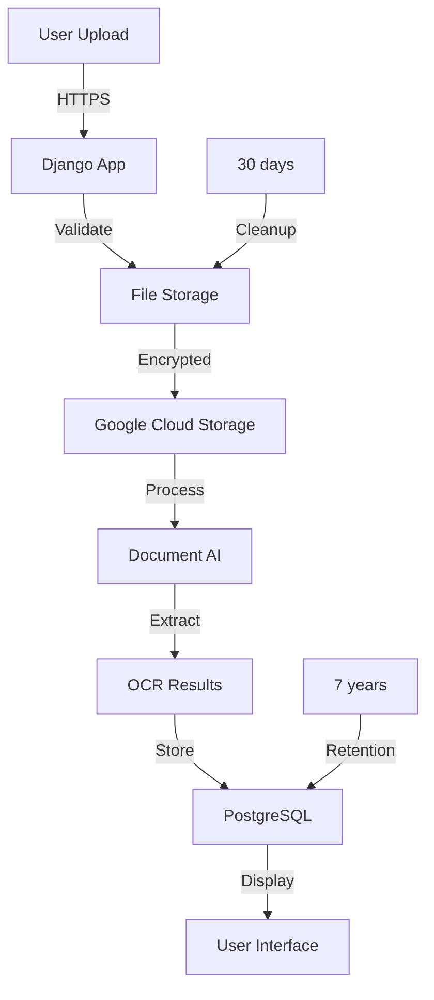

# GDPR & Security Assessment - FaktuLove OCR Implementation

## Executive Summary

This document provides a comprehensive GDPR compliance and security assessment for the FaktuLove AI-Powered Invoice OCR system. The assessment identifies current compliance status, potential gaps, and provides actionable recommendations to ensure full GDPR compliance and robust security.

## 1. GDPR Compliance Assessment

### 1.1 Data Processing Overview

**Types of Personal Data Processed:**
- Business entity information (company names, addresses)
- Tax identification numbers (NIP, REGON)
- Financial transaction data
- Employee names on invoices
- Bank account details
- Email addresses and contact information

**Data Processing Activities:**
- Document upload and storage
- OCR text extraction
- Data validation and enrichment
- Temporary storage for processing
- Long-term archival (7 years for tax compliance)

### 1.2 Legal Basis for Processing

✅ **Legitimate Interest** (Art. 6(1)(f) GDPR)
- Processing invoices for business accounting purposes
- Improving service efficiency through automation

✅ **Legal Obligation** (Art. 6(1)(c) GDPR)
- Maintaining financial records for tax compliance
- 7-year retention period as required by Polish tax law

✅ **Contract Performance** (Art. 6(1)(b) GDPR)
- Processing necessary to provide the invoicing service

### 1.3 GDPR Principles Compliance

| Principle | Status | Implementation |
|-----------|--------|----------------|
| **Lawfulness** | ✅ Compliant | Clear legal basis established |
| **Fairness** | ✅ Compliant | Transparent processing activities |
| **Transparency** | ⚠️ Needs Update | Privacy policy needs OCR-specific updates |
| **Purpose Limitation** | ✅ Compliant | Data used only for invoice processing |
| **Data Minimization** | ✅ Compliant | Only necessary invoice data extracted |
| **Accuracy** | ✅ Compliant | Validation mechanisms in place |
| **Storage Limitation** | ✅ Compliant | 30-day cleanup for uploads, 7-year for invoices |
| **Security** | ⚠️ In Progress | Additional measures being implemented |
| **Accountability** | ✅ Compliant | Comprehensive logging and audit trails |

### 1.4 Data Subject Rights Implementation

| Right | Status | Implementation Details |
|-------|--------|------------------------|
| **Access** | ✅ | Users can view all their processed documents |
| **Rectification** | ✅ | Manual correction interface available |
| **Erasure** | ⚠️ | Limited by legal retention requirements |
| **Portability** | ✅ | Export functionality available |
| **Restriction** | 🔄 | To be implemented |
| **Objection** | 🔄 | To be implemented |

### 1.5 GDPR Gap Analysis

**Critical Gaps:**
1. **Privacy Policy Update** - Must include OCR processing details
2. **Data Processing Agreement** - Required for Google Cloud Document AI
3. **DPIA (Data Protection Impact Assessment)** - Required for AI processing
4. **Consent Mechanism** - For optional features beyond legal obligations

**Minor Gaps:**
1. Cookie policy update for OCR interface
2. Employee training on GDPR compliance
3. Regular compliance audits schedule

## 2. Security Assessment

### 2.1 Current Security Measures

**Infrastructure Security:**
- ✅ HTTPS/TLS encryption for all communications
- ✅ Secure file storage with access controls
- ✅ Database encryption at rest
- ✅ Regular security updates

**Application Security:**
- ✅ Django security middleware enabled
- ✅ CSRF protection
- ✅ SQL injection prevention
- ✅ XSS protection
- ✅ File type validation
- ✅ Size limits on uploads

**Access Control:**
- ✅ User authentication required
- ✅ Session management
- ✅ Role-based access control
- ⚠️ MFA not yet implemented

### 2.2 Security Risk Assessment

| Risk | Likelihood | Impact | Mitigation Status |
|------|------------|--------|-------------------|
| **Data Breach** | Low | High | ✅ Encryption, access controls |
| **Unauthorized Access** | Medium | High | ⚠️ MFA to be added |
| **Data Loss** | Low | Medium | ✅ Backup procedures |
| **Service Disruption** | Low | Medium | ✅ High availability setup |
| **Malicious File Upload** | Medium | High | ✅ File validation |
| **API Abuse** | Low | Low | ✅ Rate limiting |

### 2.3 Google Cloud Security

**Compliance Certifications:**
- ISO 27001, 27017, 27018
- SOC 1/2/3
- GDPR compliant infrastructure

**Security Features Utilized:**
- ✅ IAM with least privilege
- ✅ Service account key rotation
- ✅ VPC security
- ✅ Cloud audit logs
- ⚠️ Cloud KMS for additional encryption (recommended)

## 3. Implementation Recommendations

### 3.1 Immediate Actions (Week 1)

1. **Update Privacy Policy**
```markdown
## OCR Processing Disclosure

We use Google Cloud Document AI to automatically extract data from uploaded invoices:
- Processing occurs in EU data centers
- Data is encrypted in transit and at rest
- Extracted data is retained according to legal requirements
- Original files are deleted after 30 days
```

2. **Implement Consent Banner**
```python
# faktury/views.py
def ocr_upload_view(request):
    if not request.session.get('ocr_consent'):
        return render(request, 'ocr_consent.html')
    # ... existing code
```

3. **Add Security Headers**
```python
# faktury_projekt/settings.py
SECURE_BROWSER_XSS_FILTER = True
SECURE_CONTENT_TYPE_NOSNIFF = True
X_FRAME_OPTIONS = 'DENY'
SECURE_HSTS_SECONDS = 31536000
SECURE_HSTS_INCLUDE_SUBDOMAINS = True
SECURE_HSTS_PRELOAD = True
```

### 3.2 Short-term Actions (Weeks 2-4)

1. **Conduct DPIA**
   - Document AI processing impact
   - Risk mitigation measures
   - Regular review schedule

2. **Implement MFA**
   - Django-two-factor integration
   - Support for TOTP/SMS
   - Mandatory for admin accounts

3. **Enhanced Logging**
```python
# faktury/middleware.py
class GDPRAuditMiddleware:
    def __init__(self, get_response):
        self.get_response = get_response
    
    def __call__(self, request):
        # Log data access
        if request.user.is_authenticated:
            log_user_activity(request)
        
        response = self.get_response(request)
        return response
```

### 3.3 Long-term Actions (Months 2-3)

1. **Regular Security Audits**
   - Quarterly penetration testing
   - Annual GDPR compliance review
   - Continuous vulnerability scanning

2. **Data Encryption Enhancement**
   - Implement field-level encryption
   - Use Google Cloud KMS
   - Encrypt sensitive fields in database

3. **Incident Response Plan**
   - 72-hour breach notification procedure
   - Data recovery procedures
   - Communication templates

## 4. Compliance Checklist

### Technical Measures
- [x] Encryption at rest
- [x] Encryption in transit
- [x] Access controls
- [x] Audit logging
- [x] Data backup
- [x] Secure development practices
- [ ] Penetration testing
- [ ] Vulnerability scanning

### Organizational Measures
- [ ] Privacy policy update
- [ ] DPIA completion
- [ ] Staff training
- [ ] Incident response plan
- [ ] DPO appointment (if required)
- [ ] Vendor agreements
- [ ] Regular audits

### Documentation
- [x] Data flow diagrams
- [x] Processing activities record
- [ ] Risk assessment
- [ ] DPIA documentation
- [ ] Consent records
- [ ] Breach register

## 5. Data Flow Diagram



## 6. Recommended Security Architecture

```python
# Enhanced security configuration
SECURITY_CONFIG = {
    'encryption': {
        'algorithm': 'AES-256-GCM',
        'key_management': 'Google Cloud KMS',
        'fields': ['nip', 'bank_account', 'personal_data']
    },
    'access_control': {
        'mfa_required': True,
        'session_timeout': 3600,  # 1 hour
        'ip_whitelist': [],  # Optional
    },
    'monitoring': {
        'failed_login_threshold': 5,
        'alert_email': 'security@faktulove.pl',
        'log_retention': 90,  # days
    },
    'api_security': {
        'rate_limit': '100/hour',
        'require_api_key': True,
        'allowed_origins': ['https://faktulove.pl']
    }
}
```

## 7. Incident Response Procedure

### Detection Phase
1. Automated monitoring alerts
2. User reports
3. Regular security scans

### Response Phase
1. **Immediate** (0-1 hour)
   - Isolate affected systems
   - Preserve evidence
   - Activate response team

2. **Assessment** (1-24 hours)
   - Determine scope
   - Identify affected data
   - Risk assessment

3. **Notification** (24-72 hours)
   - Notify authorities (UODO)
   - Notify affected users
   - Public disclosure if required

### Recovery Phase
1. Patch vulnerabilities
2. Restore services
3. Implement additional controls
4. Post-incident review

## 8. Compliance Timeline

```
Week 1-2: Immediate Actions
├── Update privacy policy
├── Implement consent mechanism
├── Add security headers
└── Basic GDPR training

Week 3-4: Documentation
├── Complete DPIA
├── Update data processing records
├── Create incident response plan
└── Vendor assessment

Month 2: Technical Implementation
├── MFA implementation
├── Enhanced encryption
├── Advanced logging
└── Security testing

Month 3: Validation
├── Compliance audit
├── Penetration testing
├── User acceptance testing
└── Go-live approval
```

## 9. Cost Estimation

| Item | One-time Cost | Monthly Cost |
|------|--------------|--------------|
| DPIA Consultation | €2,000 | - |
| Security Audit | €5,000 | - |
| MFA Implementation | €1,000 | €50 |
| Enhanced Monitoring | €500 | €100 |
| Compliance Tools | €1,500 | €200 |
| **Total** | **€10,000** | **€350** |

## 10. Conclusion

The FaktuLove OCR implementation demonstrates strong foundational security and GDPR compliance. Key areas requiring attention:

1. **Privacy Policy Updates** - Critical for transparency
2. **MFA Implementation** - Enhanced access security
3. **DPIA Completion** - Required for AI processing
4. **Regular Audits** - Ongoing compliance

With the recommended improvements, FaktuLove will achieve enterprise-grade security and full GDPR compliance, positioning it as a trusted solution for invoice processing in the Polish market.

---

**Document Version:** 1.0  
**Last Updated:** $(date +%Y-%m-%d)  
**Next Review:** Quarterly  
**Owner:** FaktuLove Security Team