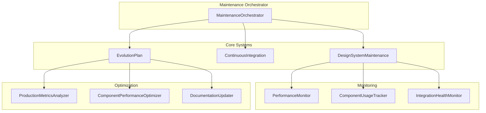

# Design System Maintenance Procedures

This document outlines the comprehensive maintenance procedures for the FaktuLove Design System, including automated processes, manual tasks, and long-term evolution planning.

## Table of Contents

1. [Overview](#overview)
2. [Maintenance System Architecture](#maintenance-system-architecture)
3. [Automated Maintenance Tasks](#automated-maintenance-tasks)
4. [Manual Maintenance Procedures](#manual-maintenance-procedures)
5. [Continuous Integration](#continuous-integration)
6. [Evolution Planning](#evolution-planning)
7. [Monitoring and Alerting](#monitoring-and-alerting)
8. [Emergency Procedures](#emergency-procedures)
9. [Tools and Scripts](#tools-and-scripts)
10. [Troubleshooting](#troubleshooting)

## Overview

The Design System maintenance framework ensures the long-term health, performance, and evolution of the FaktuLove Design System. It consists of three main components:

- **Automated Maintenance**: Daily, weekly, and monthly automated tasks
- **Continuous Integration**: Automated testing and deployment pipeline
- **Evolution Planning**: Long-term roadmap and milestone tracking

## Maintenance System Architecture



## Automated Maintenance Tasks

### Daily Tasks

#### 1. Health Check (`daily-health-check`)
- **Frequency**: Every 24 hours
- **Purpose**: Monitor design system health and performance metrics
- **Automated**: Yes
- **Actions**:
  - Check performance metrics
  - Validate component functionality
  - Monitor error rates
  - Generate health score

#### 2. Security Scan (`daily-security-scan`)
- **Frequency**: Every 24 hours
- **Purpose**: Scan for security vulnerabilities
- **Automated**: Yes
- **Actions**:
  - Run dependency vulnerability scan
  - Check for known security issues
  - Validate security configurations
  - Generate security report

### Weekly Tasks

#### 1. Compatibility Check (`weekly-compatibility-check`)
- **Frequency**: Every 7 days
- **Purpose**: Verify browser compatibility
- **Automated**: Yes
- **Actions**:
  - Test across supported browsers
  - Check for compatibility regressions
  - Validate polyfill requirements
  - Update compatibility matrix

#### 2. Performance Audit (`weekly-performance-audit`)
- **Frequency**: Every 7 days
- **Purpose**: Comprehensive performance analysis
- **Automated**: Yes
- **Actions**:
  - Analyze bundle size
  - Check render performance
  - Monitor memory usage
  - Generate optimization recommendations

#### 3. Dependency Updates (`weekly-dependency-update`)
- **Frequency**: Every 7 days
- **Purpose**: Update dependencies to latest versions
- **Automated**: Partially (requires approval for major updates)
- **Actions**:
  - Check for outdated dependencies
  - Test compatibility with updates
  - Apply safe updates automatically
  - Flag major updates for review

### Monthly Tasks

#### 1. Documentation Review (`monthly-documentation-review`)
- **Frequency**: Every 30 days
- **Purpose**: Review and update documentation
- **Automated**: Partially
- **Actions**:
  - Analyze component usage patterns
  - Identify documentation gaps
  - Generate documentation updates
  - Review Polish business documentation

#### 2. Test Suite Validation (`monthly-test-suite-validation`)
- **Frequency**: Every 30 days
- **Purpose**: Validate test coverage and quality
- **Automated**: Yes
- **Actions**:
  - Check test coverage metrics
  - Identify missing tests
  - Validate test quality
  - Update test suites

#### 3. Component Audit (`monthly-component-audit`)
- **Frequency**: Every 30 days
- **Purpose**: Audit component usage and performance
- **Automated**: Yes
- **Actions**:
  - Analyze component usage patterns
  - Identify unused components
  - Check for performance issues
  - Generate optimization recommendations

## Manual Maintenance Procedures

### Quarterly Reviews

#### 1. Polish Business Compliance Review
- **Frequency**: Every 3 months
- **Responsible**: Business Team
- **Purpose**: Review Polish business requirements and regulations
- **Actions**:
  1. Review current Polish business regulations
  2. Validate NIP, REGON, KRS validation logic
  3. Check VAT rate compliance
  4. Update business component requirements
  5. Test Polish business workflows

#### 2. Technology Roadmap Review
- **Frequency**: Every 3 months
- **Responsible**: Architecture Team
- **Purpose**: Review and update technology roadmap
- **Actions**:
  1. Assess current technology stack
  2. Evaluate new technologies
  3. Plan migration strategies
  4. Update roadmap timelines
  5. Identify technical debt

### Annual Reviews

#### 1. Design System Strategy Review
- **Frequency**: Yearly
- **Responsible**: Leadership Team
- **Purpose**: Strategic review of design system direction
- **Actions**:
  1. Evaluate design system adoption
  2. Review business impact metrics
  3. Plan strategic initiatives
  4. Update long-term vision
  5. Allocate resources for next year

## Continuous Integration

### CI Pipeline Stages

1. **Unit Tests**
   - Component functionality tests
   - Utility function tests
   - Polish business logic tests

2. **Integration Tests**
   - Component interaction tests
   - Theme integration tests
   - Form workflow tests

3. **Visual Regression Tests**
   - Component visual comparison
   - Layout regression detection
   - Cross-browser visual testing

4. **Accessibility Tests**
   - WCAG 2.1 AA compliance
   - Keyboard navigation tests
   - Screen reader compatibility

5. **Performance Tests**
   - Bundle size analysis
   - Render performance tests
   - Memory usage validation

6. **End-to-End Tests**
   - Complete user workflows
   - Polish business scenarios
   - Cross-module integration

### Deployment Process

#### Staging Deployment
1. Run full CI pipeline
2. Deploy to staging environment
3. Run smoke tests
4. Validate Polish business functionality
5. Generate deployment report

#### Production Deployment
1. Require staging validation
2. Run security checks
3. Create deployment backup
4. Deploy with feature flags
5. Monitor performance metrics
6. Validate business functionality

## Evolution Planning

### Milestone Management

#### Milestone Categories
- **Feature**: New functionality
- **Improvement**: Enhancements to existing features
- **Maintenance**: Technical debt and updates
- **Breaking Change**: Major version updates
- **Polish Business**: Business-specific enhancements

#### Milestone Lifecycle
1. **Planning**: Define requirements and scope
2. **In Progress**: Active development
3. **Review**: Testing and validation
4. **Completed**: Delivered and validated
5. **Cancelled**: Discontinued (with reason)

### Version Planning

#### Version Types
- **Major (X.0.0)**: Breaking changes, major features
- **Minor (X.Y.0)**: New features, improvements
- **Patch (X.Y.Z)**: Bug fixes, security updates

#### Release Schedule
- **Patch releases**: As needed (security/critical fixes)
- **Minor releases**: Quarterly
- **Major releases**: Annually or as needed

### Technology Roadmap

#### Current Technology Stack
- React 18.2.0
- TypeScript 4.9.0
- Webpack 5.75.0
- Storybook 7.0.0

#### Planned Upgrades
- React 19.0.0 (Q3 2025)
- TypeScript 5.2.0 (Q2 2025)
- Webpack 5.90.0 (Q1 2025)
- Storybook 8.0.0 (Q4 2025)

## Monitoring and Alerting

### Health Metrics

#### Performance Metrics
- Bundle size (target: <500KB)
- Component render time (target: <16ms)
- Page load time (target: <2s)
- Memory usage (monitor for leaks)

#### Quality Metrics
- Test coverage (target: >90%)
- Accessibility score (target: >95%)
- Error rate (target: <1%)
- Component adoption (target: >80%)

#### Business Metrics
- Polish business component usage
- NIP validation accuracy
- VAT calculation correctness
- User satisfaction scores

### Alert Thresholds

#### Critical Alerts
- Security vulnerabilities (immediate)
- System downtime (immediate)
- Critical test failures (immediate)
- Performance degradation >50% (immediate)

#### Warning Alerts
- Performance degradation >25% (4 hours)
- Test coverage drop >10% (24 hours)
- Accessibility score drop >5% (24 hours)
- Maintenance tasks overdue >3 days (daily)

#### Info Alerts
- New dependency updates available (weekly)
- Documentation updates needed (monthly)
- Milestone progress updates (weekly)

## Emergency Procedures

### Critical Issue Response

#### 1. Security Vulnerability
1. **Immediate Actions**:
   - Assess vulnerability impact
   - Implement temporary mitigation
   - Notify security team
   - Create incident ticket

2. **Short-term Actions** (within 24 hours):
   - Develop permanent fix
   - Test fix thoroughly
   - Deploy to staging
   - Validate fix effectiveness

3. **Long-term Actions** (within 1 week):
   - Deploy to production
   - Update security procedures
   - Conduct post-incident review
   - Update documentation

#### 2. System Downtime
1. **Immediate Actions**:
   - Identify root cause
   - Implement rollback if needed
   - Notify stakeholders
   - Activate incident response team

2. **Recovery Actions**:
   - Restore service functionality
   - Validate system health
   - Monitor for stability
   - Document incident details

#### 3. Performance Degradation
1. **Assessment**:
   - Identify affected components
   - Measure performance impact
   - Determine user impact
   - Prioritize fix urgency

2. **Mitigation**:
   - Implement quick fixes
   - Optimize critical paths
   - Monitor improvements
   - Plan comprehensive solution

## Tools and Scripts

### CLI Tools

#### Maintenance CLI (`scripts/maintenance-cli.js`)
```bash
# Run health check
node scripts/maintenance-cli.js health-check --save

# Run specific maintenance task
node scripts/maintenance-cli.js run-maintenance --task daily-health-check

# Run CI pipeline
node scripts/maintenance-cli.js run-ci --trigger manual

# Deploy to environment
node scripts/maintenance-cli.js deploy --env staging --version 1.2.0

# Generate report
node scripts/maintenance-cli.js generate-report --type comprehensive

# List maintenance tasks
node scripts/maintenance-cli.js list-tasks

# Check evolution status
node scripts/maintenance-cli.js evolution-status
```

#### Optimization CLI (`scripts/optimize-design-system.js`)
```bash
# Run full optimization analysis
node scripts/optimize-design-system.js

# Generate optimization report
node scripts/optimize-design-system.js --report-only
```

### Automated Scripts

#### Daily Automation
```bash
# Add to crontab for daily execution
0 2 * * * cd /path/to/project && node scripts/maintenance-cli.js health-check
0 3 * * * cd /path/to/project && node scripts/maintenance-cli.js run-maintenance
```

#### Weekly Automation
```bash
# Add to crontab for weekly execution
0 4 * * 0 cd /path/to/project && node scripts/optimize-design-system.js
0 5 * * 0 cd /path/to/project && node scripts/maintenance-cli.js generate-report
```

### Monitoring Integration

#### Performance Monitoring
```typescript
import { initializeMaintenanceSystem } from './frontend/src/design-system/maintenance';

// Initialize maintenance system
const maintenance = await initializeMaintenanceSystem({
  enableAutomaticOptimization: false,
  enableDocumentationUpdates: true,
  performanceThreshold: 80,
  optimizationInterval: 24
});

// Start monitoring
await maintenance.startOrchestration();
```

## Troubleshooting

### Common Issues

#### 1. High Bundle Size
**Symptoms**: Bundle size exceeds 500KB threshold
**Diagnosis**:
```bash
node scripts/maintenance-cli.js health-check
node scripts/optimize-design-system.js
```
**Solutions**:
- Enable code splitting
- Remove unused components
- Optimize dependencies
- Implement lazy loading

#### 2. Performance Degradation
**Symptoms**: Component render time >16ms
**Diagnosis**:
```bash
node scripts/maintenance-cli.js run-ci --trigger performance
```
**Solutions**:
- Add React.memo to components
- Optimize state management
- Reduce prop drilling
- Implement virtualization

#### 3. Test Failures
**Symptoms**: CI pipeline failing tests
**Diagnosis**:
```bash
node scripts/maintenance-cli.js run-ci
```
**Solutions**:
- Review test logs
- Update test expectations
- Fix component issues
- Update test dependencies

#### 4. Security Vulnerabilities
**Symptoms**: Security scan alerts
**Diagnosis**:
```bash
node scripts/maintenance-cli.js health-check --save
```
**Solutions**:
- Update vulnerable dependencies
- Apply security patches
- Review security configurations
- Implement additional safeguards

### Maintenance Task Failures

#### Task: `daily-health-check`
**Common Failures**:
- Performance monitoring unavailable
- Component usage tracking errors
- Health calculation failures

**Solutions**:
1. Check monitoring system status
2. Restart performance monitors
3. Validate component tracking
4. Review error logs

#### Task: `weekly-performance-audit`
**Common Failures**:
- Bundle analysis errors
- Performance measurement timeouts
- Memory profiling issues

**Solutions**:
1. Check build system status
2. Increase timeout values
3. Optimize measurement process
4. Review system resources

#### Task: `monthly-documentation-review`
**Common Failures**:
- Documentation generation errors
- Usage pattern analysis failures
- File system permission issues

**Solutions**:
1. Check file permissions
2. Validate documentation templates
3. Review usage tracking data
4. Update documentation tools

### Recovery Procedures

#### System Recovery
1. **Stop all maintenance processes**:
   ```bash
   node scripts/maintenance-cli.js stop-all
   ```

2. **Check system health**:
   ```bash
   node scripts/maintenance-cli.js health-check
   ```

3. **Restart maintenance system**:
   ```bash
   node scripts/maintenance-cli.js start-maintenance
   ```

4. **Validate functionality**:
   ```bash
   node scripts/maintenance-cli.js run-maintenance --task daily-health-check
   ```

#### Data Recovery
1. **Backup current state**:
   ```bash
   cp -r .maintenance-data .maintenance-data.backup
   ```

2. **Restore from backup**:
   ```bash
   cp -r .maintenance-data.backup .maintenance-data
   ```

3. **Validate data integrity**:
   ```bash
   node scripts/maintenance-cli.js validate-data
   ```

## Best Practices

### Maintenance Scheduling
- Run critical tasks during low-traffic hours
- Stagger maintenance tasks to avoid resource conflicts
- Monitor system resources during maintenance
- Keep maintenance windows short and focused

### Documentation
- Keep maintenance logs for audit purposes
- Document all manual procedures
- Update procedures based on lessons learned
- Maintain runbooks for common scenarios

### Monitoring
- Set up proactive alerts for potential issues
- Monitor trends, not just current values
- Use multiple metrics for comprehensive health assessment
- Regular review and adjustment of thresholds

### Team Coordination
- Assign clear ownership for maintenance tasks
- Establish escalation procedures for critical issues
- Regular training on maintenance procedures
- Cross-training to avoid single points of failure

## Contact Information

### Maintenance Team
- **Primary Contact**: DevOps Team (devops@faktulove.com)
- **Secondary Contact**: Development Team (dev@faktulove.com)
- **Emergency Contact**: On-call Engineer (oncall@faktulove.com)

### Escalation Path
1. **Level 1**: Maintenance Team
2. **Level 2**: Development Team Lead
3. **Level 3**: Engineering Manager
4. **Level 4**: CTO

---

*This document is maintained by the FaktuLove Engineering Team and is updated quarterly or as needed based on system changes and lessons learned.*